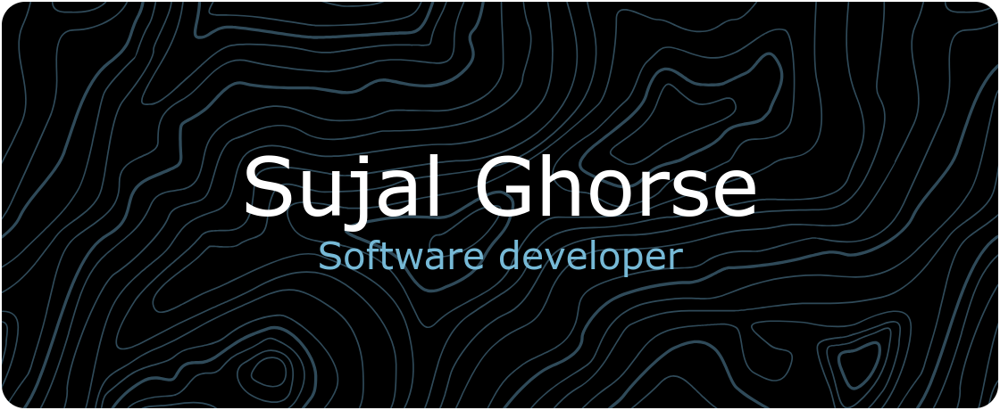

<h1 align="center">Hi 👋, I'm Sujal Ghorse.</h1>
<h3 align="center">A curious and passionate Frontend and Backend developer.</h3>

<h4 align="center">Things I am doing these days.</h4>

- Currently, I am learning Golang and building mini backend projects to understand backend concepts better. 
- I am actively learning and working on my growth. 
- I am seeking opportunities for internships, jobs, or contributions to work on exciting projects.

Email: sujalghorse9@gmail.com

### Socials:

 

### Tech Stack:
   !                           

# GitHub Stats:
 
 

---

